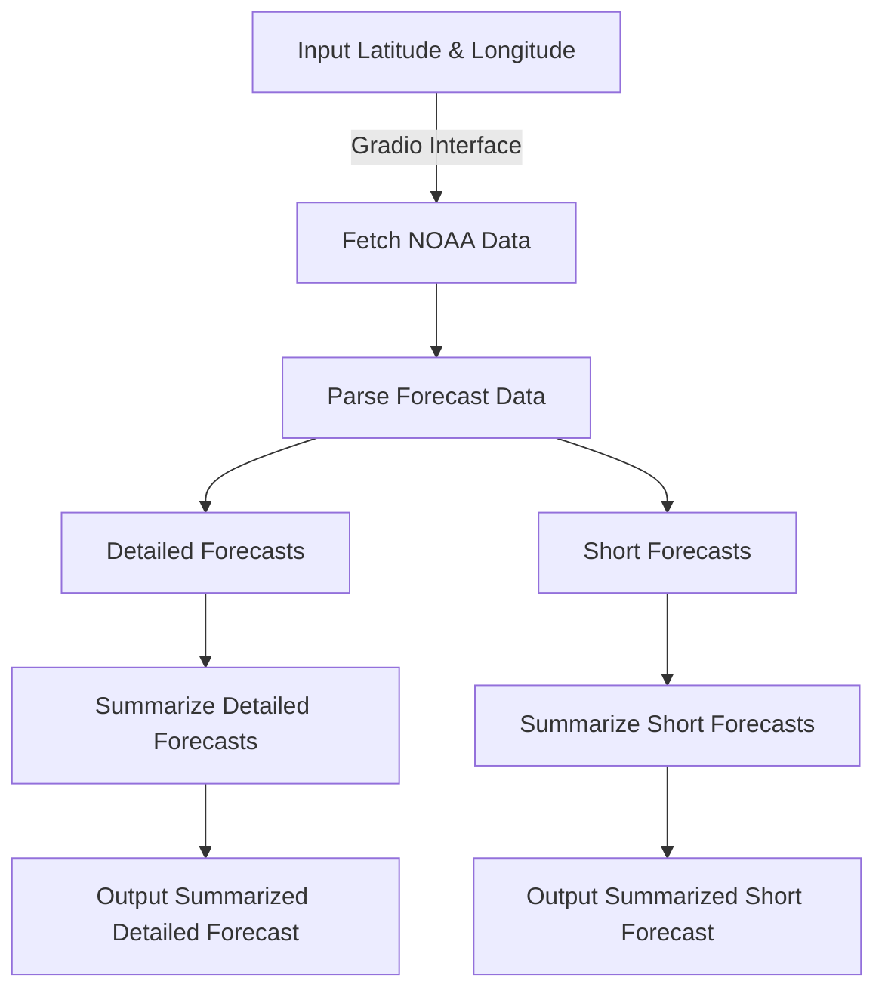

# NOAA Weather Summarizer

## Overview

The NOAA Weather Summarizer is a Python-based project that retrieves weather forecasts from the National Weather Service (NWS) API, processes the data, and provides detailed and summarized forecasts. The application uses Gradio for a user-friendly web interface and OpenAI for text summarization.

## Features

- Fetch raw weather data from NOAA's National Weather Service (NWS) API.
- Parse and summarize:
  - Detailed weather forecasts.
  - Short weather forecasts.
- Summarize merged forecasts using OpenAI's GPT models.
- Interactive Gradio interface for user input and display.

## Workflow



## Installation

### Prerequisites

- Python 3.8 or later
- Pip

### Setup

1. Clone the repository:
    ```bash
    git clone https://github.com/your-repo/noaa-weather-summarizer.git
    cd noaa-weather-summarizer
    ```
2. Install the required Python packages:
    ```bash
    pip install -r requirements.txt
    ```
3. Set up your OpenAI API key and optional Hugging Face token:
    - Add your OpenAI API key directly in the script or as an environment variable (`OPENAI_API_KEY`).
    - Optionally, set `HF_TOKEN` in your environment for authenticated Hugging Face access.

## Usage

Run the application:

```bash
python app.py
```

This will launch a Gradio interface where you can input latitude and longitude values to fetch and display weather forecasts.

### Example Inputs

- **Dallas, TX:** Latitude `32.7767`, Longitude `-96.7970`
- **New York City, NY:** Latitude `40.7128`, Longitude `-74.0060`

## Requirements

### `requirements.txt`

```
cachetools
gradio
requests
spacy
openai
torch  # Optional for GPU checks
```

```python
python -m spacy download en_core_web_trf
```

## Sample RAW Data JSON from NOAA API

```json
{
  "@context": [
    "https://geojson.org/geojson-ld/geojson-context.jsonld",
    {
      "@version": "1.1",
      "wx": "https://api.weather.gov/ontology#",
      "geo": "http://www.opengis.net/ont/geosparql#",
      "unit": "http://codes.wmo.int/common/unit/",
      "@vocab": "https://api.weather.gov/ontology#"
    }
  ],
  "type": "Feature",
  "geometry": {
    "type": "Polygon",
    "coordinates": [
      [
        [
          -96.7897,
          32.7685
        ],
        [
          -96.78999999999999,
          32.7911
        ],
        [
          -96.81689999999999,
          32.7908
        ],
        [
          -96.81649999999999,
          32.7682
        ],
        [
          -96.7897,
          32.7685
        ]
      ]
    ]
  },
  "properties": {
    "units": "us",
    "forecastGenerator": "BaselineForecastGenerator",
    "generatedAt": "2024-12-26T13:00:41+00:00",
    "updateTime": "2024-12-26T10:08:34+00:00",
    "validTimes": "2024-12-26T04:00:00+00:00/P8DT6H",
    "elevation": {
      "unitCode": "wmoUnit:m",
      "value": 136.8552
    },
    "periods": [
      {
        "number": 1,
        "name": "Today",
        "startTime": "2024-12-26T07:00:00-06:00",
        "endTime": "2024-12-26T18:00:00-06:00",
        "isDaytime": true,
        "temperature": 62,
        "temperatureUnit": "F",
        "temperatureTrend": "",
        "probabilityOfPrecipitation": {
          "unitCode": "wmoUnit:percent",
          "value": 90
        },
        "windSpeed": "0 to 5 mph",
        "windDirection": "NNE",
        "icon": "https://api.weather.gov/icons/land/day/tsra,90?size=medium",
        "shortForecast": "Patchy Fog",
        "detailedForecast": "A chance of rain showers and patchy fog before 9am, then patchy fog and showers and thunderstorms between 9am and noon, then patchy fog and showers and thunderstorms. Cloudy. High near 62, with temperatures falling to around 60 in the afternoon. North northeast wind 0 to 5 mph. Chance of precipitation is 90%. New rainfall amounts between a half and three quarters of an inch possible."
      },
      {
        "number": 2,
        "name": "Tonight",
        "startTime": "2024-12-26T18:00:00-06:00",
        "endTime": "2024-12-27T06:00:00-06:00",
        "isDaytime": false,
        "temperature": 49,
        "temperatureUnit": "F",
        "temperatureTrend": "",
        "probabilityOfPrecipitation": {
          "unitCode": "wmoUnit:percent",
          "value": null
        },
        "windSpeed": "0 to 5 mph",
        "windDirection": "WNW",
        "icon": "https://api.weather.gov/icons/land/night/bkn/fog?size=medium",
        "shortForecast": "Mostly Cloudy then Patchy Fog",
        "detailedForecast": "Patchy fog after 2am. Mostly cloudy, with a low around 49. West northwest wind 0 to 5 mph."
      },
      {
        "number": 3,
        "name": "Friday",
        "startTime": "2024-12-27T06:00:00-06:00",
        "endTime": "2024-12-27T18:00:00-06:00",
        "isDaytime": true,
        "temperature": 68,
        "temperatureUnit": "F",
        "temperatureTrend": "",
        "probabilityOfPrecipitation": {
          "unitCode": "wmoUnit:percent",
          "value": null
        },
        "windSpeed": "0 to 10 mph",
        "windDirection": "SW",
        "icon": "https://api.weather.gov/icons/land/day/fog/sct?size=medium",
        "shortForecast": "Patchy Fog then Mostly Sunny",
        "detailedForecast": "Patchy fog before 10am. Mostly sunny. High near 68, with temperatures falling to around 64 in the afternoon. Southwest wind 0 to 10 mph."
      },
      {
        "number": 4,
        "name": "Friday Night",
        "startTime": "2024-12-27T18:00:00-06:00",
        "endTime": "2024-12-28T06:00:00-06:00",
        "isDaytime": false,
        "temperature": 48,
        "temperatureUnit": "F",
        "temperatureTrend": "",
        "probabilityOfPrecipitation": {
          "unitCode": "wmoUnit:percent",
          "value": null
        },
        "windSpeed": "5 mph",
        "windDirection": "SSW",
        "icon": "https://api.weather.gov/icons/land/night/sct?size=medium",
        "shortForecast": "Partly Cloudy",
        "detailedForecast": "Partly cloudy, with a low around 48. South southwest wind around 5 mph."
      },
      {
        "number": 5,
        "name": "Saturday",
        "startTime": "2024-12-28T06:00:00-06:00",
        "endTime": "2024-12-28T18:00:00-06:00",
        "isDaytime": true,
        "temperature": 70,
        "temperatureUnit": "F",
        "temperatureTrend": "",
        "probabilityOfPrecipitation": {
          "unitCode": "wmoUnit:percent",
          "value": null
        },
        "windSpeed": "5 to 10 mph",
        "windDirection": "WSW",
        "icon": "https://api.weather.gov/icons/land/day/sct?size=medium",
        "shortForecast": "Mostly Sunny",
        "detailedForecast": "Mostly sunny. High near 70, with temperatures falling to around 65 in the afternoon. West southwest wind 5 to 10 mph."
      },
      {
        "number": 6,
        "name": "Saturday Night",
        "startTime": "2024-12-28T18:00:00-06:00",
        "endTime": "2024-12-29T06:00:00-06:00",
        "isDaytime": false,
        "temperature": 45,
        "temperatureUnit": "F",
        "temperatureTrend": "",
        "probabilityOfPrecipitation": {
          "unitCode": "wmoUnit:percent",
          "value": null
        },
        "windSpeed": "0 to 5 mph",
        "windDirection": "WNW",
        "icon": "https://api.weather.gov/icons/land/night/few?size=medium",
        "shortForecast": "Mostly Clear",
        "detailedForecast": "Mostly clear. Low around 45, with temperatures rising to around 47 overnight. West northwest wind 0 to 5 mph."
      },
      {
        "number": 7,
        "name": "Sunday",
        "startTime": "2024-12-29T06:00:00-06:00",
        "endTime": "2024-12-29T18:00:00-06:00",
        "isDaytime": true,
        "temperature": 69,
        "temperatureUnit": "F",
        "temperatureTrend": "",
        "probabilityOfPrecipitation": {
          "unitCode": "wmoUnit:percent",
          "value": null
        },
        "windSpeed": "0 to 5 mph",
        "windDirection": "SW",
        "icon": "https://api.weather.gov/icons/land/day/few?size=medium",
        "shortForecast": "Sunny",
        "detailedForecast": "Sunny, with a high near 69. Southwest wind 0 to 5 mph."
      },
      {
        "number": 8,
        "name": "Sunday Night",
        "startTime": "2024-12-29T18:00:00-06:00",
        "endTime": "2024-12-30T06:00:00-06:00",
        "isDaytime": false,
        "temperature": 50,
        "temperatureUnit": "F",
        "temperatureTrend": "",
        "probabilityOfPrecipitation": {
          "unitCode": "wmoUnit:percent",
          "value": null
        },
        "windSpeed": "5 mph",
        "windDirection": "S",
        "icon": "https://api.weather.gov/icons/land/night/few?size=medium",
        "shortForecast": "Mostly Clear",
        "detailedForecast": "Mostly clear, with a low around 50. South wind around 5 mph."
      },
      {
        "number": 9,
        "name": "Monday",
        "startTime": "2024-12-30T06:00:00-06:00",
        "endTime": "2024-12-30T18:00:00-06:00",
        "isDaytime": true,
        "temperature": 76,
        "temperatureUnit": "F",
        "temperatureTrend": "",
        "probabilityOfPrecipitation": {
          "unitCode": "wmoUnit:percent",
          "value": null
        },
        "windSpeed": "5 to 10 mph",
        "windDirection": "SW",
        "icon": "https://api.weather.gov/icons/land/day/few?size=medium",
        "shortForecast": "Sunny",
        "detailedForecast": "Sunny, with a high near 76. Southwest wind 5 to 10 mph, with gusts as high as 25 mph."
      },
      {
        "number": 10,
        "name": "Monday Night",
        "startTime": "2024-12-30T18:00:00-06:00",
        "endTime": "2024-12-31T06:00:00-06:00",
        "isDaytime": false,
        "temperature": 44,
        "temperatureUnit": "F",
        "temperatureTrend": "",
        "probabilityOfPrecipitation": {
          "unitCode": "wmoUnit:percent",
          "value": null
        },
        "windSpeed": "5 to 10 mph",
        "windDirection": "NW",
        "icon": "https://api.weather.gov/icons/land/night/skc?size=medium",
        "shortForecast": "Clear",
        "detailedForecast": "Clear, with a low around 44."
      },
      {
        "number": 11,
        "name": "Tuesday",
        "startTime": "2024-12-31T06:00:00-06:00",
        "endTime": "2024-12-31T18:00:00-06:00",
        "isDaytime": true,
        "temperature": 60,
        "temperatureUnit": "F",
        "temperatureTrend": "",
        "probabilityOfPrecipitation": {
          "unitCode": "wmoUnit:percent",
          "value": null
        },
        "windSpeed": "5 to 10 mph",
        "windDirection": "N",
        "icon": "https://api.weather.gov/icons/land/day/skc?size=medium",
        "shortForecast": "Sunny",
        "detailedForecast": "Sunny, with a high near 60."
      },
      {
        "number": 12,
        "name": "Tuesday Night",
        "startTime": "2024-12-31T18:00:00-06:00",
        "endTime": "2025-01-01T06:00:00-06:00",
        "isDaytime": false,
        "temperature": 38,
        "temperatureUnit": "F",
        "temperatureTrend": "",
        "probabilityOfPrecipitation": {
          "unitCode": "wmoUnit:percent",
          "value": null
        },
        "windSpeed": "5 mph",
        "windDirection": "N",
        "icon": "https://api.weather.gov/icons/land/night/few?size=medium",
        "shortForecast": "Mostly Clear",
        "detailedForecast": "Mostly clear, with a low around 38."
      },
      {
        "number": 13,
        "name": "New Year's Day",
        "startTime": "2025-01-01T06:00:00-06:00",
        "endTime": "2025-01-01T18:00:00-06:00",
        "isDaytime": true,
        "temperature": 56,
        "temperatureUnit": "F",
        "temperatureTrend": "",
        "probabilityOfPrecipitation": {
          "unitCode": "wmoUnit:percent",
          "value": null
        },
        "windSpeed": "5 mph",
        "windDirection": "NNE",
        "icon": "https://api.weather.gov/icons/land/day/sct?size=medium",
        "shortForecast": "Mostly Sunny",
        "detailedForecast": "Mostly sunny, with a high near 56."
      },
      {
        "number": 14,
        "name": "Wednesday Night",
        "startTime": "2025-01-01T18:00:00-06:00",
        "endTime": "2025-01-02T06:00:00-06:00",
        "isDaytime": false,
        "temperature": 36,
        "temperatureUnit": "F",
        "temperatureTrend": "",
        "probabilityOfPrecipitation": {
          "unitCode": "wmoUnit:percent",
          "value": null
        },
        "windSpeed": "0 to 5 mph",
        "windDirection": "NE",
        "icon": "https://api.weather.gov/icons/land/night/sct?size=medium",
        "shortForecast": "Partly Cloudy",
        "detailedForecast": "Partly cloudy, with a low around 36."
      }
    ]
  }
}
```

## Screenshots

(Add screenshots here)


## License

This project is licensed under the MIT License. See the `LICENSE` file for details.

## Contributing

Contributions are welcome! Feel free to open an issue or submit a pull request.

## Acknowledgements

- [NOAA National Weather Service API](https://www.weather.gov/documentation/services-web-api)
- [OpenAI GPT Models](https://openai.com/)
- [Gradio](https://gradio.app/)
- [spaCy](https://spacy.io/)

## Contact

For issues or inquiries, please contact [your.email@example.com](mailto:your.email@example.com).

