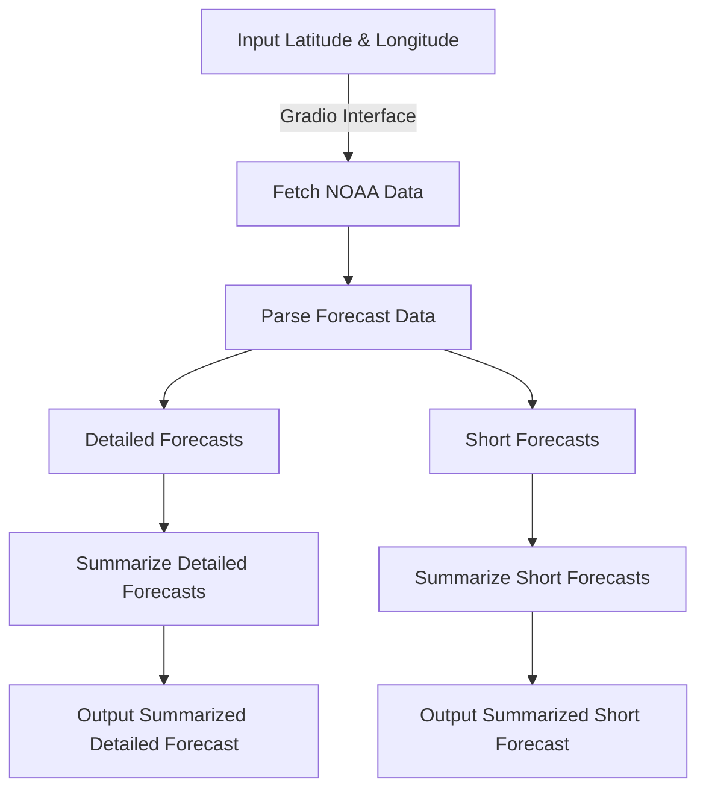

# NOAA Weather Summarizer

## Overview

The NOAA Weather Summarizer is a Python-based project that retrieves weather forecasts from the National Weather Service (NWS) API, processes the data, and provides detailed and summarized forecasts. The application uses Gradio for a user-friendly web interface and OpenAI for text summarization.

## Features

- Fetch raw weather data from NOAA's National Weather Service (NWS) API.
- Parse and summarize:
  - Detailed weather forecasts.
  - Short weather forecasts.
- Summarize merged forecasts using OpenAI's GPT models.
- Interactive Gradio interface for user input and display.

## Workflow



## Installation

### Prerequisites

- Python 3.8 or later
- Pip

### Setup

1. Clone the repository:
    ```bash
    git clone https://github.com/your-repo/noaa-weather-summarizer.git
    cd noaa-weather-summarizer
    ```
2. Install the required Python packages:
    ```bash
    pip install -r requirements.txt
    ```
3. Set up your OpenAI API key and optional Hugging Face token:
    - Add your OpenAI API key directly in the script or as an environment variable (`OPENAI_API_KEY`).
    - Optionally, set `HF_TOKEN` in your environment for authenticated Hugging Face access.

## Usage

Run the application:

```bash
python app.py
```

This will launch a Gradio interface where you can input latitude and longitude values to fetch and display weather forecasts.

### Example Inputs

- **Dallas, TX:** Latitude `32.7767`, Longitude `-96.7970`
- **New York City, NY:** Latitude `40.7128`, Longitude `-74.0060`

## Requirements

### `requirements.txt`

```
cachetools==5.3.0
gr==3.38.0
requests==2.31.0
spacy==3.6.0
openai==0.27.8
torch==2.0.1  # Optional for GPU checks
```

## Screenshots

(Add screenshots here)

## License

This project is licensed under the MIT License. See the `LICENSE` file for details.

## Contributing

Contributions are welcome! Feel free to open an issue or submit a pull request.

## Acknowledgements

- [NOAA National Weather Service API](https://www.weather.gov/documentation/services-web-api)
- [OpenAI GPT Models](https://openai.com/)
- [Gradio](https://gradio.app/)
- [spaCy](https://spacy.io/)

## Contact

For issues or inquiries, please contact [your.email@example.com](mailto:your.email@example.com).
